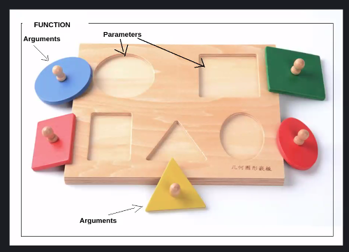

# W1D4 - Callbacks and Funtions

### Instructor: Vasily Klimkin

## Content

- Functions - What? Where? Why? When? How?
- Callbacks
- Arrow Functions
- .forEach()
- .map()

## Functions

What is a function? Why even use functions? What's the point?

- DRY
- Groups a bunch of code
- Packs functionality
- Performs one specific task
- Can be stored in a variable

Typical variable declarations: `let/const/var variableName = variable;`

Function syntax:

```javascript
const functionName = function (fruitName, numOfFruits) {
  console.log("Here is my number of fruits:");
  console.log(fruitname);
  console.log(numOfFruits);
};
```



Functions are called in this way:

```javascript
const fruit = "apple";
const number = 1;
functionName("banana", 99); //this works
functionName(fruit, number); //this works too
```

## Callbacks

Because functions are variables they can also be passed as arguments:

```javascript
const prettyFruitPrint = function () {
  // a function
};

const functionName = function (fruitName, numOfFruits, func) {
  console.log("Here is my number of fruits:");
  console.log(fruitname);
  console.log(numOfFruits);
  console.log("Here is my function", func);
};

functionName(fruit, number, prettyPrintFruit()); //this is an example of using a callback
```

> Passing functions like this is one of the biggest things node.js has to offer." - Vasily

Callback functions can also take arguments as well:

```javascript
const prettyFruitPrint = function(f, n) { // a function
console.log('-----------------');
console.log('fruit: '), f, '     number: '. n);
console.log('-----------------');
};

const numFruit = function(fruitName, numOfFruits, func) {
 func(fruitName,numOfFruits);
};

numFruit(fruit, number, prettyPrintFruit);
```

In this case numFruit is a high-order function and prettyFruitPink is a callback function.

## Anonymous Functions

In the same way we can declare arguments like `'banana'` and `99` in-line, we can also declare the function argument in-line:

```javascript
const numFruit = function (fruitName, numOfFruits, func) {
  func(fruitName, numOfFruits);
};

numFruit("banana", 99, function (a, b) {
  console.log("not a very pretty print....");
  console.log(a, b);
});
```

Declaring a function in this way is called an anonymous function, it doesn't have name but it's type is Function.

> Why would we want to do this?

- DRY
- Maximum Reusability
- Async (will cover next week)

## Arrow Functions

The example below contains two functions, one is declared `= function`. The other uses arrow function notation `()=>`:

```javascript
const arr = [1,'two',3,'four',5,'six,'7,'eight',9,'ten'];

// a function that prints only the numbers from an array
const printOnlyNumbers = function(array) {
  console.log(" --- Only Numbers --- ");
  for (let val of array) {
    if (typeof val === 'number'){
      console.log(val);
    }
  }
};

printOnlyNumbers(arr); //expect 1,3,5,7,9

// a funciton that prints out only strings from an array
const printOnlyStrings = (array) => {
 console.log(" --- Only Strings --- ");
  for (let val of array) {
    if (typeof val === 'string'){
      console.log(val);
    }
  }
};

printOnlyStrings(arr) // expect two,four,six,eight,ten
```

> Arrow functions have different scoping properties that will be covered later.

The problems above could be solved in a dryer way using a an anonymous arrow function as our argument for callback:

```javascript
const arr = [1,'two',3,'four',5,'six,'7,'eight',9,'ten'];

const printOnly = (array, callback) => {
  for (let val of array) {
    if (callback(val)){
      console.log(val);
    }
  }
};

printOnly(arr, (v) =>{
  return typeof v === "number";
}); // expect 1,3,5,7,9

printOnly(arr, (v) =>{
  return typeof v === "string";
}); // expect two,four,six,eight,ten
```

## .forEach()

The combination of callbacks and anonymous arrow functions can be quite powerful as seen below:

```javascript
const forEvery = function (array, cb) {
  for (let val of array) {
    //loops over array
    cb(val); //does whatever our callback says to do with val
  }
};

let sumOfNumbers = 0;
forEvery(arr, (v) => {
  if (typeof v === "number") {
    sumOfNumbers += v;
  }
}); //expect 25
```

The functionality of `forEvery` above already exists in javaScript as [Array.prototype.forEach()](https://developer.mozilla.org/en-US/docs/Web/JavaScript/Reference/Global_Objects/Array/forEach). `.forEach()` takes optional parameters and is more powerful than what we have implemented above with `forEvery`. Like other Array methods this `.forEach()` method is available to all arrays.

## .map()

One way to take in an array and return a modified version of it (some experssion is used on all elements of the array) is shown below:

```javascript
let input = [1, 2, 3, 4, 5];

const result = [];

for (let val of input) {
  const answer = val * 2;
  result.push(answer);
}

console.log(result); // expect 2,4,6,8,10
```

This can be achieved with the .map() method:

```javascript
let input = [1, 2, 3, 4, 5];

const result = input.map((val) => {
  return val * 2;
});

console.log(result); // expect 2,4,6,8,10
```

The .map() method takes a callback function, this is operation that is being applied to each element of the array.
