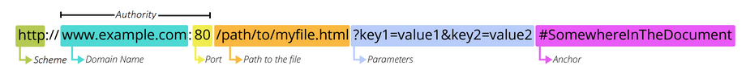

# HTTP

## HTTP Flow

1. Open a TCP connection
2. Send an HTTP message
3. Read a response sent by the server

HTTP messages:

- 1.1 are human readable
- 2 are embedded into a binary structure called a frame.

Two kinds of message, with unique format:

- Request
- Response

## Request

Method: like GET or POST.. or OPTIONS or HEAD.
Path: a path to the resource to fetch (path doesn't include protocol, domain, or TCP port)
Version of Protocol: 1.1 or 2 for example
Headers: optional that convey additional information for the servers

> or a body for some methods like POST (contains the resources sent)

## RESPONSE

Version of Protocol: protocol version
Status Code: if the request was succesful or not
Status Message: non authoritative message or short description of the status code
Headers: like those of request

> or a body containing the fetched response

## API Based on HTTP

Most commmon one is XMLHttpRequest API which can be used to exchange data between a user agent and a server. Modern Fetch API provides the same features with a more powerful flexible feature set.

Server-sent events is a one-way service that allows a server to send events to the client using HTTP as a transport mechanism.

## Our Focus

Focus for now will be on PATH and METHOD of requests. Path says what resource the client wants to act on, and the method says what action it would like to perform.

### Methods

9 HTTP Requests Methods:

- GET: used to "get" some data from the server
- POST: usually used to create some new data
- PUT: generally used for editing existing data on the server
- DELETE: used to delete some existing data

## Paths and URL Structure

Need a Uniform Resource Locator (URL) to request a resource - see components below:

Scheme: https or http are common protocols but also there is mailto: scheme or ftp: scheme

Domain: indicates which Web Server is being requested.

Port: Indicates a technical "gate" for accessing resourcesa on the web server. Usually ommitted if the website uses the stand ports (80 for HTTP and 443 for HTTPS)

> Seperator between the scheme and the Authority (Domain & Port) is `://` -- the colon `:` seperates the scheme from the next part of the URL and the `//` indicates the next part of the URL is the authority. Ommitted in cases like `mailto:foobar` where the scheme does us an authority as a component.

Path: `/path/to/myfile.html` the path the resource on the webserver

Parameters: extra parameters provided to the webserver - most like a list of key:value pairs seperated with the & symbol

Anchor: `#somewhereinthedocument` -> points to a specific part of the resource itself. Anchors are like a bookmark inside a resource that give the browsers directions to show the content located at the "bookmarked" spot. The part after the fragment identifier (`#`) is never sent to the server with the request.

## Status Codes and Body of Responses

Server reads the method and the path to figure out what to do. If a request is something like `GET / dogs` the server is going to try and return all the data about dogs it has. After it has tried the requested action it sends back a response.

There are [ALOT](https://developer.mozilla.org/en-US/docs/Web/HTTP/Status) of status codes but here are some important ones:

200: "Everything went great!"
201: "The request succeeded and a new resource has been created as a result."
404: "The resource was not found."
500: "The server had an error."

New codes get added all the time, like 451 - a status code the indicates the resource is not available for legal reasons.

### Response Body

Will contain some data such as the data the client originally requested. May be stored in different formats like text, images, webpages (HTML) or data encoded in JSON

### Headers

Programmers can inject extra information into requests and responses called "headers" which is a key:value way of storing data.
