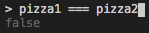

# Classes in JS OOP

## Disclaimer

JavaSripts object system is based on *prototypes* not classes. 

> JavaScript mimics the behaviour of class-bassed, or classical OOP, languages now.

Expereienced developers are expected to know how both prototypes and classes work.

## Classes are blueprints

A blueprint has all the instructions and details needed to build a house, but it is *NOT* a house.

We can use the blueprint as a guide to build a new house. We can use the blueprint as many times as we want. All the houses are seperate and unique even if the the instructions and details are the same.

In OOP classes are blueprints that we use to create *instances* of objects.

## Class
```javascript
class Pizza {
  // more on this later
}
```
* Declare a class with the `class` keyword.
* Names are usually a noun.
* The first letter should always be capitalized.
* Create a new instace of the class (object) by using the `new` keyword.
```javascript
let pizza1 = new Pizza();
let pizza2 = new Pizza();
```
* Notice that pizza1 and pizza2 have the same properties (none) but are unique objects 


## Methods and Properties

We can declare a class so that it can allow all instances to have properties. 

```javascript
class Pizza {

  constructor() {
    this.toppings = ["cheese"];
  }

  addTopping(topping) {
    this.toppings.push(topping);
  }

}
```

Classes can describe properties (using constructors) and methods. All instances of that class will have the described properties and methods.

### Constructor
`constructor` is a special kind of method that gets executed when an object instance is created from a class. Everything inside contructor() will get run for a new instance of the class when we call `new Class`. This is a great way to setup state for new instances (default properties).

We can also pass values to `constructor(arg1, arg2)` when we define it and then again when we call `new Class(arg1, arg2)`

## Primitives as Objects

Each primitive in JavaSript (excluding symbol) has a corresponding object constructor:

* new Boolean()
* new String()
* new Number()
* etc.

We can see the pitfalls here in the example below:

```javascript
const greeting = "hello world"
const objGreeting = new String("hello world")
greeting == objGreeting //type coercion makes it true
greeting === objGreeting //strict equality says they're different
```

## Inheritance

We can use inheritance to avoid code duplication, here's an example of duplication:

```javascript
class Student {
  // this constructor is identical to that of a mentor!
  constructor(name, quirkyFact) {
    this.name = name;
    this.quirkyFact = quirkyFact;
  }

  // here is a method that is specific to students
  enroll(cohort) {
    this.cohort = cohort;
  }

  // identical! Smells of code duplication
  bio() {
    return `My name is ${this.name} and here's my quirky fact: ${this.quirkyFact}`;
  }
}

class Mentor {
  // this constructor is identical to that of a student!
  constructor(name, quirkyFact) {
    this.name = name;
    this.quirkyFact = quirkyFact;
  }

  // specific to mentors
  goOnShift() {
    this.onShift = true;
  }

  // specific to mentors
  goOffShift() {
    this.onShift = false;
  }

  // identical! Smells of code duplication
  bio() {
    return `My name is ${this.name} and here's my quirky fact: ${this.quirkyFact}`;
  }
}
```

Here the Student and Mentor classes have identical constructor and bio methods. They also share some properties.

We can remove this duplication by moving the shared code from the two classes into another class. Then we can use a technique know as inheritance. 

With inheritance we can build a new class based on an existing class:

```javascript
class Person {
  // moved here b/c it was identical
  constructor(name, quirkyFact) {
    this.name = name;
    this.quirkyFact = quirkyFact;
  }

  // moved here b/c it was identical
  bio() {
    return `My name is ${this.name} and here's my quirky fact: ${this.quirkyFact}`;
  }
}

class Student extends Person {
  // stays in Student class since it's specific to students only
  enroll(cohort) {
    this.cohort = cohort;
  }
}

class Mentor extends Person {
  // specific to mentors
  goOnShift() {
    this.onShift = true;
  }

  // specific to mentors
  goOffShift() {
    this.onShift = false;
  }
}
```

In this example Student and Mentor extend Person and inherit behaviour and state information. Student and Mentor are subclasses of Person (the superclass).

## Super

Another keyword often found in OOP Langues is `super`

Sometimes you want a subclass to have a similar but slightly different behaviour to its superclass. In the person, student and mentor example we might want the bio's to start with "I'm a mentor at Lighthouse Labs" prior to saying "My name is..."

When a subclass implements a method that already exists in the superclass it is called **method overriding**. While this achieves the goals - it's not ideal because the code isn't exactly DRY.

We can actually implement this method in in mentor and invoke the bio() from person  using `super.bio()`. Like so:

```javascript
class Mentor extends Person {
  // Mentor bios need a bit more info than you're average person.
  bio() {
    return `I'm a mentor at Lighthouse Labs. ${super.bio()}`;
    //specifacally done with a template literal because person.bio() also returns a string.
  }
}
```

## Getters and Setters

A few reasons we might want to add .get() and .set() methods to our classes is:
1. We can validate the date inside the method beefore assigning it to a property.
2. We can compute a value on the fly without having to set and pull it out of a property.

### Validation

Here is a validation example from pizza.js

```javascript
class Pizza {

  // ...

  // setSize now includes data validation
  setSize(size) {
    if (size === 's' || size === 'm' || size === 'l') {
      this.size = size;
    }
    // else we could throw an error, return false, etc.
    // We choose here to ignore all other values!
  }
}

// DRIVER CODE
let pizza = new Pizza();
pizza.setSize('s');

```

### Compute A Value

Also from pizza.js

```javascript
class Pizza {

  // ...

  getPrice() {
    const basePrice = 10;
    const toppingPrice = 2;
    return basePrice + (this.toppings.length * toppingPrice);
  }
}

// DRIVER CODE
let pizza = new Pizza();
pizza.getPrice();

```

## A Better Way to Get and Set

Since this is very common in OOP - javascript has included special `get` and `set` keywords.

In order to make this work we'll make sure we have to be careful with names:

```javascript
class Pizza {

  // ...

  // replace our custom getters / setters with these ones!
  get price() {
    const basePrice = 10;
    const toppingPrice = 2;
    return basePrice + this.toppings.length * toppingPrice;
  }

  set size(size) {
    if (size === 's' || size === 'm' || size === 'l') {
      this._size = size; ///see what we did there? 0.o
    }
  }
}
```

The big difference with `get` and `set` are that they are acessed as if they were value properties instead of method properties. Like so:

```javascript
let pizza = new Pizza();

pizza.price;      // instead of getPrice()
pizza.size = 's'; // instead of setSize(size)
```

These keywords do some background work to bind an objects property to a function that will be called when the value is looked up.