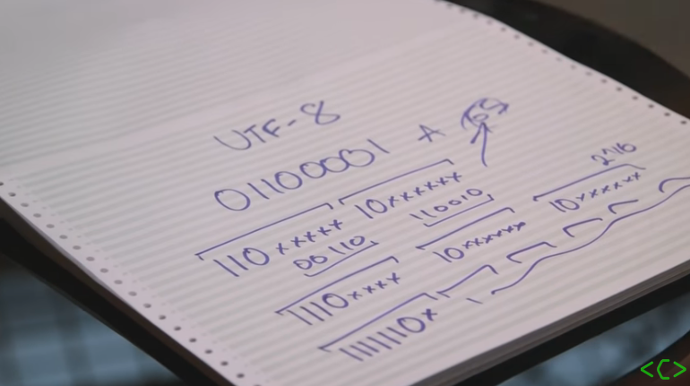

# Encoding

Character encoding helps not plain English text present with the appropriate style and characters. Also helps with SEO

## What is it?

* Words and scentences are created from characters. 
* Characters are grouped into a character set or repetoire
* Each character is associated with a number called a code point
* Characters are stored as one or more bytes
* If characters are stored in a code (Cipher) 
  * encoding provides a key to crack the code.

## How does it work?

When you input text using a keyboard (or some other ways) the encoding maps characters you choose to specific bytes in computer memory.

The output then reads the bytes back into characters to display it.

There are many different waysr (encodings) to map between bytes, code points and characters.

## What about fonts?

Fonts are a collection of glyph definitions (the shapes used to display characters)

Once the characters are encoded, the browser will then look in the font for glyphs it can use to display the encoded characters.

A given font will usually cover a single character set (see repetoire)

> In the case of a large character set like [Unicode](https://www.w3.org/International/articles/definitions-characters/#unicode), just a subset of all the characters in a set.

If a font doesn't have a glyph for a certain character some browsers will look for the missing glyphs in other fonts on the system (Which means they will look diferent)

If the glyph is foudn nowhere you will see a square box, question mark or some other character instead

## Developers

As a content author or developer ytou should always choose the [UTF-8](https://en.wikipedia.org/wiki/UTF-8) character encoding for your content or data.

UTF-8 is a good Unicode encoding choice because you can use a single character encoding to handle any character you are likely to need.

Content authors need to [declare the character](https://www.w3.org/International/questions/qa-html-encoding-declarations) encoding used for the document format they are working with.

[Check that your server is serving documents with the right HTTP declarations](https://www.w3.org/International/questions/qa-headers-charset)

## Unicode Miracle

The unicode consortium have assigned 100,000+ characters to over 100,000 numbers

UTF-8 encoded the english aplhabet the same way that ASCII did (a = 65 A is 32 later) - this resulted in lots of extra zeros for english text

Eight 0's in a row presented a problem for older systems which interpreted that as an end of file code

UTF-8 is also backwards compatible. By using header bits to describe the byte length of the encoded character they never have to send 8 0's. See this image:

