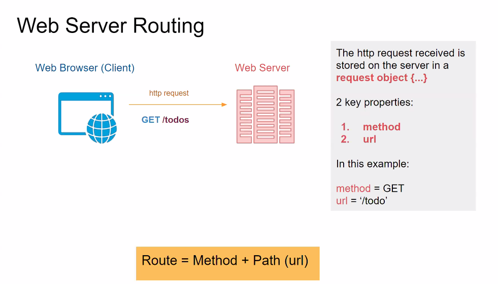
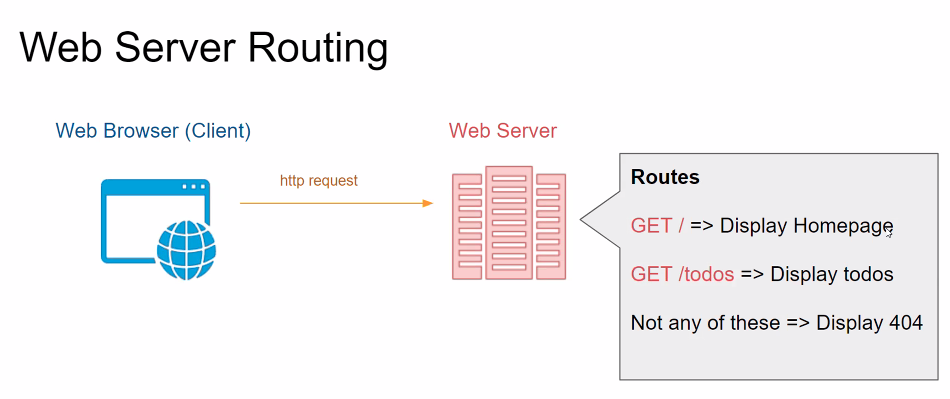

# Web Servers 101

## Instructor: Dominic Tremblay

## Content
* What is Node.js
* What is a web server
* Creating a web server with vanilla Node.js
* Create a web server with Express.js

> Because he didn't Node how to Express himself

## What is Node.js
* Node.js is a Javascript runtime built on Chrome's v8 JavaScript engine
* Node.js' package ecosystem, npm, is the largest ecosystem of open source libraries in the world
* Node.js uses an event-driven, non-blocking, I/O model that makes it lightweight and efficient.

It's not:

* A framework:
  * A framework has some built in functionality for me that makes my life easier. Nothing in node.js specifically makes our life easier.
* The same as v8 - the javascript engine that runs in the browser does not have access to the filesystem or networking. C++ libraries add this functionality to v8. Node.js has added this.
* Intended to run in the browser.
* Multi-threaded. The javascript engine is single-threaded, but allows nonblocking IO. 
* Created in 10 days in 1995 by Brendan Eich (that's javascript)
  * Ryan Dahl/Daw made it in 2009. (sp?)

## What is a web server

  * A web server accepts http request from the user's browser and responds by sending back (usually) HTML documents
    * Can send back JSON, and some other formats (XML?)
  * A web server can recieve requests from a client based on http verbs: create, update, read and delete.
  * A web server is a http server
  * Port 80 is the default port for http servers

It's not:

* where cookies are stored.
* only able to server static HTML pages.

## Web 3-Tier Architecture

1. Web Browser (or other Client)
  * Primary function is to render HTML document
  * Makes an http request to the web server.
  * Renders the content (parses the html code) recieved from the web server.
2. Web Server
  * Accepts http requests from clients and send back the resource
  * Listens for http requests from client. Depending on what the client asks - makes an SQL query in the database.
  * Responds to client with Content
3. Database
  * Keeps the data persistent. Allows C.R.U.D. operations with SQL.
  * Can have database on same machine on the webserver, or completely seperate (different networked machine or even in the cloud)
    * Firestore, postgressQL
  * Sends the data retrieved with the SQL query back to the webserver.

Web Server is though of as a machine, but on the machien we will run software (node.js/express)

Express will make running a web server easier. 

### Request

* A web browser sends requests to a web server using `http`
  * Example: if you are talking to someone in English - the other person needs to speak English
  * request = http verb + path (resource)
  * 4 http verbs:
    1. POST   (Create)
    2. GET    (Read)
    3. PUT    (Update)
    4. DELETE (Delete)
* Path: anything after `https://www.lighthouselabs.ca` example: `/web-developement-bootcamp`

### Response

* Might send back a document, plus a [status](https://http.cat/)[code](https://developer.mozilla.org/en-US/docs/Web/HTTP/Status)

### Request and Response

Contain 2 parts:

Headers + body

* Headers:
  * Request or response meta-information
* Body
  * Information submitted (Form) in the case of the Request
  * Response sent by the server (HTML documents mostly)

## Web Server Routing



> Route and Endpoint are synonyms



## Create a Web Server

```javascript


//creating a server with plain node.js
const todos = require('./db/todos') // a little hack to simulate a database by exporting an object from a js file
const fs = require('fs')
const http = require('http'); // step 1 : require http a core module of node
const port = 3000;   // step 2: define the port

// create a request handler:
const getHomepage = (req, res) => {
  // send back status code
  res.writeHead(200, { 'content-type':'text/html' }); //create an entry in the response header writeHead(responseCode, contentType : identifier)
  //send back the content of the response

  fs.readFile('./views/index.html', 'utf8', (error, content)=>{
    if (error) {
      console.log(error.message);
      return;
    } 

    res.write(content);

  })
  //terminate the request
  res.end();
}

const display404 = (req,res) => {
  //... same as above but response is 404
}

const getTodos = (req,res) => {
  // set content application/json
  res.writeHead(200, { 'content-type':'application/json' });
  // read the todos from the database
  //convert the todos to JSON
  // send back the todos
  res.write(JSON.stringify(todos));
  // terminate the request
  res.end();
}

// step 3: create the http server
const server = http.createServer((req, res)=>{
  // request and response in this are objects that are created by node for this create Server method

  const headers = req.headers;
  const route = `${req.method} ${req.path}`;
  // examples of what properties exist in the request object

  if (route === 'GET /') {
    // display homepage
    getHomepage(req, res);

  } else if (route === 'GET /todos') {
    //display a list of todos as JSON

    getTodos(req,res);

  } else {
    // display 404;

    display404(req,res);
  }
  // send back a response
});

// step  4: have the server listen for incoming requests
server.listen(port ()=> console.log('The server is listening on port', port));
```

## Express.js
> In node we created our own request handler, in express we don't need to do that.

```javascript
const todos = require('./db/todos'); // our db hack again
const express = requre('express');
const port = 3000;

//create the web server => creating an express app
const app = express();

//tell express that we're using ejs to render our views (html)
//ejs stands for embedded javascript => a mix of HTML + javascript

app.set('view engine', 'ejs'); // views files must be .ejs not .html for this to work => different from jsx which is used in react
                                // another view templating enging is handlebars - the default templating engine for Express is Jade
//request handlers
//routing system of express

app.get('/', (req, res) => {
  //displaying the homepage
  res.status(200).render('index'); //if the status is 200 render index.ejs - doesnt require a path (will look in ./views by default) or an extension (will only render .ejs files) 
});

app.get('/todos', (req,res) => {
  res.status(200).json(todos); //.json does the work of JSON.stringify etc. etc. from our pure node.js web server
});

app.get('*', (req,res) => {
  res.status(404).render('404')
}

//have the webserver listen for incoming requests
app.listen(port, ()=> console.log(`the server is listening on port ${port}`));
```

```javascript
//rendering with embedded javascript
app.get('/todos', (req,res) => {
  res.status(200).render('todos', {todosList: todos}); //this is going to pass the array of objects we have required to our todos.ejs in views 
});
```

Inside todos.ejs our keyname becomes the variable name.

```html
<ul>
  <!--- <% % >= everything inside is javascript, everything outside of it is HTML-->
  <% for (let todoObj of todosList) { %>
    <li><%todoObj.description %><li/>
  <% }%>
</ul>
```