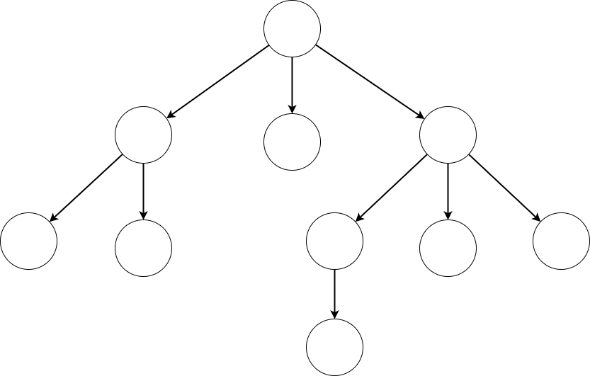

# Trees

## Content
* Explain what data structures are
* Explain what a tree is
* Explain why trees are useful
* Use a tree to organize data
* Explain what tree traversal is
* Explain the different between breadth first and depth first search
* Use depth first search to search for an object in a tree

## Data Structures

* Every app contains some sort of data.
* Sometimes the data is simple: example - variable like strings, booleans or numbers
* Sometimes data is complex: arrays, objects.
* Complex data are data structures
  * Arrays are great for ordered lists
  * Objects are good for for lookup with key
  * These are common data structures that exist in most languages but there are many more...

## Intro to Trees

An org chart is like a tree:
  * At the top we have a CEO
   * Below are their direct reports
    * And so on.

Key takeaway: every employee has one supervisor and every supervisor can have multiple employees. Only one employee is without a supervisor (the CEO)



This is an abstract representation of a tree in computer science.

Each circle represents a node.

A node is a key entity and contains data bout that entity. In the case of an org chart each node represents an employee and the data is their name.

* The node at the top of the tree is called the root noode.
* The nodes at the bottom are called leaf nodes.
* Every node except for the root node has a single parent node.
* Every node that is not a leaf node has 1 or more children nodes.
* All the children of the same parent node are siblings


## Other Examples of Trees

1. The Browser's Dom
  * Parent - Parent Element
    * Children - Child Elements
    * Data - attributes (id, class, etc)

2. The File System
  * Parent - ../
    * Children - ./*
    * Data - contents of the file, metadata etc.
  
## Tree Traversal

When referencing a tree we typically don't have access to the entire tree, just a reference to it's root.

Unlike an array where we can simply loop over the reference to the array to scry the data inside it, there is no simple for loop for a tree structure.

When traversing a tree there are two ways to do it: Breadth First and Depth first

## Breadth First v Depth First

Will check the nodes closest to the root node, before checking the nodes that are farther away.

Depth first will always be trying to check the leaf nodes. 

### Depth First

1. Visit the root node of the tree
2. Get the first unvisited child sub-tree of the current node
3. Do Step 1 with the sub-tree

```javascript
lass Node {

  constructor(data) {
    this.data = data;
    this.parent = null;
    this.children = [];
  }

  depthFirstTraversal() {

    console.log(this); // 1

    for (const childNode of this.children) {
      childNode.depthFirstTraversal(); // 2
    }
  }
}
```


