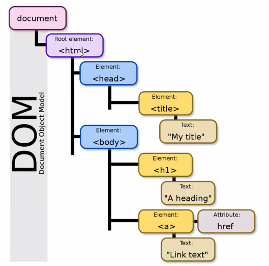

# Manipulating The DOM

### Instructor: Dominic Tremblay

## Content

* BOM
* DOM
* Manipulating the DOM with Javascript
* Manipulating the  DOM with jQuery

## BOM

Browser object model is a hierachy of browser objects.

* Window
  * Location, Navigator, Document, Screen, History, Event, Frames

[Cool tool for playing with code](codesandbox.io)

```javascript
// display window properties
console.log("Width: ",window.innerWidth)
console.log("Width: ",window.innerHeight)
// using window location and history
window.location = './hello.html'
history.pushState(null, null, "/hello") //have to handle things client side when changing location in a single page app
history.back();

// displaying user agent
console.log(window.navigator.userAgent);

// get the geolocation
window.navigator.geolocation.getCurrentPosition((pos)=> {
  console.log(pos.coords.latitude, pos.coords.longitude)
})

```

## DOM



The document is converted into the DOM

We can manipulate it with Javascript

```javascript
document.getElementById(idSelector) 
document.getElementsByTagName(tagName)
document.getElementsByName(name)
document.querySelector(selector)  //need to specify the css selector ('.wrap') for class="wrap" or '#id' for id="id"
document.querySelectorAll(selector) //
document.getElementsByClassName(className) //gives all elements of that class
```

### Todo List example

Before we can create elements out of thin air we first need to register an event handler so that our DOM changes can be comitted by way of a callback.

```javascript
const frm = document.querySelector('#new-todo-frm');

frm.addEventListener("submit", function (event) {
  event.preventDefault(); //prevent default behaviour of form submission

  const inputBox = frm.elements.todo;

  const todoContent = inputBox.value;

  const newLi = document.createElement('li')

  newLi.setAttribute("class", "li-item");

  newLi.textContent = todoContent;

  const todoList = docuent.getElementById('todos');

  todoList.append(newLi);

  inputBox.value = '';

  inputBox.focus();
})
```

## jQuery v Javascript

jQuery is a sugar coating on javascript to make manipulating the dom easier.

When you wanted to code javascript in the browser you would have to use different methods in different browsers. jQuery's biggest strength is accounting for these differences behind the scenes.

## Manipulating the DOM with JQuery

fast, small, feature-rich JavaScript library.

It makes things much simpler:

* HTML document traversal and manipulation
* Event handling
* Animation
* AJAX much simpler
* Works across a multitude of browsers

### DOM Traversal

```javascript
import $ from "jQuery";

$(document).ready(function() {
  const btns = $('.alien-btn');

  btns.on("click", function(event) {

    const parentElement = $(this).closest(".alien-section")
    const talk = parentElement.find('.talk');
    talk.append(":speechbubble:")
  })

})
```

### Create HTML Dynamically with jQuery

```javascript
const createArticleElement = (petObj) => {
  //... a big string literal
}

const renderArticles = petsArr => {
  for (const petObj of petsArr) {
    const newElement = createArticleElement(petsObj)
    $('#pets-container').append(newElement);
  }
};

$(document).ready(function () {
  renderArticles(petsArr);
})
```